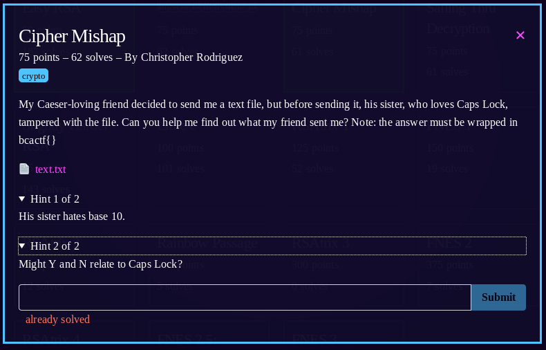

1) text.txt contains:
<pre>
126-Y, 113-N, 122-N, 130-N, 117-N, 107-N, 137, 114-N, 127-Y, 137, 113-Y, 104-N, 131-N, 110-N, 137, 105-Y, 110-N, 110-N, 121-Y, 137, 131-Y, 114-N, 112-N, 110-N, 121-N, 110-N, 125-N, 110-N, 137, 114-Y, 121-N, 126-N, 127-N, 110-N, 104-N, 107-N
</pre>
1) based on the hint "Caeser-loving friend", i assume it's a caeser cipher (i.e. ROTXX)
1) ASCII only goes up to 127 in base10. so since we have numbers in here greater than 137, we can assume the base is less than 10.  Stripping the letters and using [cyberchef](https://gchq.github.io/CyberChef/)base 8 results in <pre> VKRXOG_LW_KDYH_EHHQ_YLJHQHUH_LQVWHDG </pre>
1) assuming the underscores aren't ROTd this looks like the flag format
1) shift all alphabetical characters 3 to the left results in <pre>SHOULD\IT\HAVE\BEEN\VIGENERE\INSTEAD</pre> [which is likely the flag](https://gchq.github.io/CyberChef/#recipe=From_Octal('Space')ROT47(-3)&input=MTI2LCAxMTMsIDEyMiwgMTMwLCAxMTcsIDEwNywgMTM3LCAxMTQsIDEyNywgMTM3LCAxMTMsIDEwNCwgMTMxLCAxMTAsIDEzNywgMTA1LCAxMTAsIDExMCwgMTIxLCAxMzcsIDEzMSwgMTE0LCAxMTIsIDExMCwgMTIxLCAxMTAsIDEyNSwgMTEwLCAxMzcsIDExNCwgMTIxLCAxMjYsIDEyNywgMTEwLCAxMDQsIDEwNw)
1) last step is to adjust capitalization based on the original [text](text.txt) "Y" & "N"
1) doing so results in Should_iT_Have_BeeN_Vigenere
1) flag: **bcactf{Should_iT_Have_BeeN_Vigenere}**