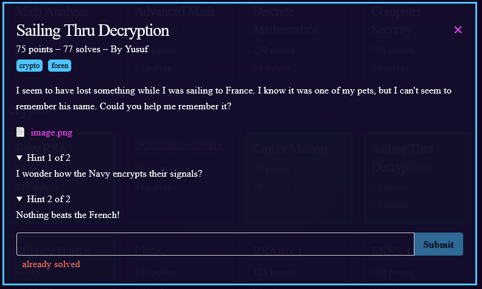
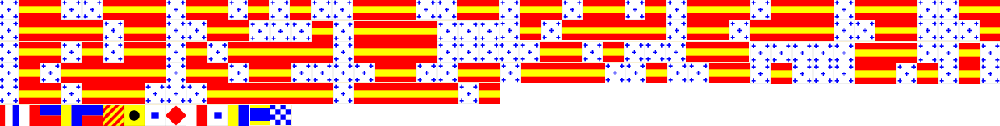

1) opening the image file gives

2) googling "flag code french crypto" gives a [nautical flag tool](https://www.dcode.fr/maritime-signals-code) on dcode.fr
3) the White star translates to 0 and the yellow/red bars translate to 1.  translating the first 4 lines results in
```
011001110110101001110011011011010111011101110011
011110110011000101111000010111110110111100110001
011010110101111101111000001101000111000001110010
010111110110110000110011011110010011010001101010
011011100011111101111101
```
4) the symbols at the bottom translate to "THEKEYISFHSKDN"
5) analyzing the binary in [cyberchef](https://gchq.github.io/CyberChef/#recipe=From_Binary('Space',8)&input=MDExMDAxMTEwMTEwMTAxMDAxMTEwMDExMDExMDExMDEwMTExMDExMTAxMTEwMDExCjAxMTExMDExMDAxMTAwMDEwMTExMTAwMDAxMDExMTExMDExMDExMTEwMDExMDAwMQowMTEwMTAxMTAxMDExMTExMDExMTEwMDAwMDExMDEwMDAxMTEwMDAwMDExMTAwMTAKMDEwMTExMTEwMTEwMTEwMDAwMTEwMDExMDExMTEwMDEwMDExMDEwMDAxMTAxMDEwCjAxMTAxMTEwMDAxMTExMTEwMTExMTEwMQ) results in "gjsmws{1x_o1k_x4pr_l3y4jn?}"
6) looks like we have the right special characters and all that is left is a substitution. The only substitution cipher i know is the vigenere
7) trying a [vigenere decode with key "FHSKDN"](https://gchq.github.io/CyberChef/#recipe=From_Binary('Space',8)Vigen%C3%A8re_Decode('FHSKDN')&input=MDExMDAxMTEwMTEwMTAxMDAxMTEwMDExMDExMDExMDEwMTExMDExMTAxMTEwMDExCjAxMTExMDExMDAxMTAwMDEwMTExMTAwMDAxMDExMTExMDExMDExMTEwMDExMDAwMQowMTEwMTAxMTAxMDExMTExMDExMTEwMDAwMDExMDEwMDAxMTEwMDAwMDExMTAwMTAKMDEwMTExMTEwMTEwMTEwMDAwMTEwMDExMDExMTEwMDEwMDExMDEwMDAxMTAxMDEwCjAxMTAxMTEwMDAxMTExMTEwMTExMTEwMQ) gives us the flag
8) flag: **bcactf{1s_h1s_n4me_g3r4rd?}**