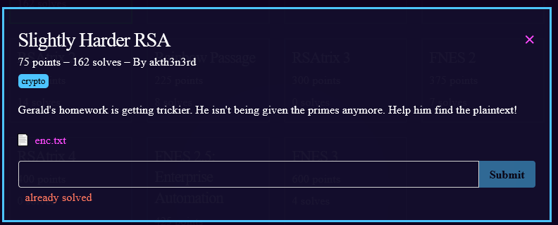

1) Another RSA problem.  reading enc.txt we get values for n, e, and ciphertext
2) This is enough for [RSACTFtool](https://github.com/Ganapati/RsaCtfTool) to solve it for us
3) `python3 RsaCtfTool/RsaCtfTool.py --uncipher 811950322931973288295794871117780672242424164631309902559564 -n 947358141650877977744217194496965988823475109838113032726009 -e 65537 --private`
4) output
``` 
Unciphered data :
HEX : 0x000000006263616374667b7273615f666163746f72696e677d
INT (big endian) : 143794522380749587603817933677936428593350769010557
INT (little endian) : 787173844933937024933607070503163813295685054057247756255232
STR : b'\x00\x00\x00\x00bcactf{rsa_factoring}'
```
5) flag: **bcactf{rsa_factoring}**