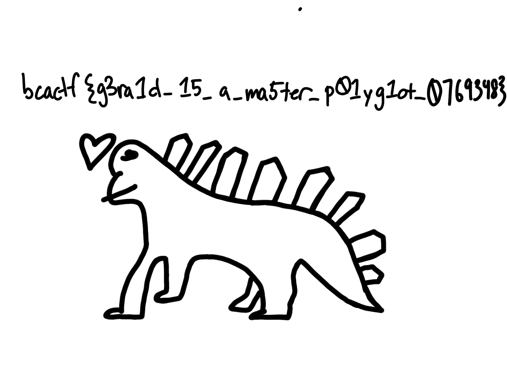

1) opening ["gerald.pdf"](gerald.pdf) gives a false flag of "bcactf{get_bamboozled_lol}":
1) looking a little deeper with `binwalk gerald.pdf` shows there is something hidden 
<pre>
DECIMAL       HEXADECIMAL     DESCRIPTION
0             0x0             PDF document, version: "1.3"
66            0x42            Zip archive data, at least v2.0 to extract, uncompressed size: 441011, name: GeraldFlag.png
390777        0x5F679         Zip archive data, at least v2.0 to extract, uncompressed size: 367, name: __MACOSX/._GeraldFlag.png
391327        0x5F89F         End of Zip archive, footer length: 22
392072        0x5FB88         Zlib compressed data, default compression
722826        0xB078A         Zlib compressed data, default compression
723219        0xB0913         End of Zip archive, footer length: 22'
</pre>
1) `binwalk gerald.pdf -e`
1) gives us 
1) flag: **bcactf{g3ra1d_15_a_ma5ter_p01yg1ot_0769348}**