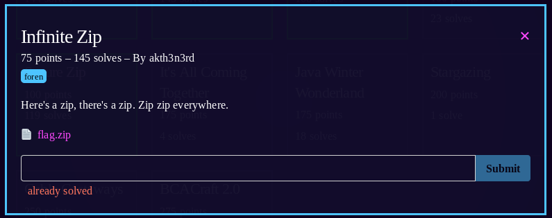
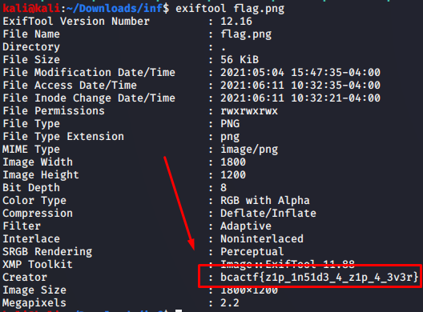

1) `unzip flag.zip` gives us "999.zip", unzip that gives "998.zip", and so on and so forth. i wrote a simple bash script to automate this
2) ```
#!/bin/bash
unzip flag.zip
for i in {999..0}
do
 unzip $i.zip
done
3) After 999 unzips we get [flag.png](flag.png).  This is a fake flag, and the link included is also a troll link.  Taking a look at it with `strings flag.png` shows some text mentioning exiftool
4) `exiftool flag.png` gives us the 
5) flag: **bcactf{z1p_1n51d3_4_z1p_4_3v3r}**