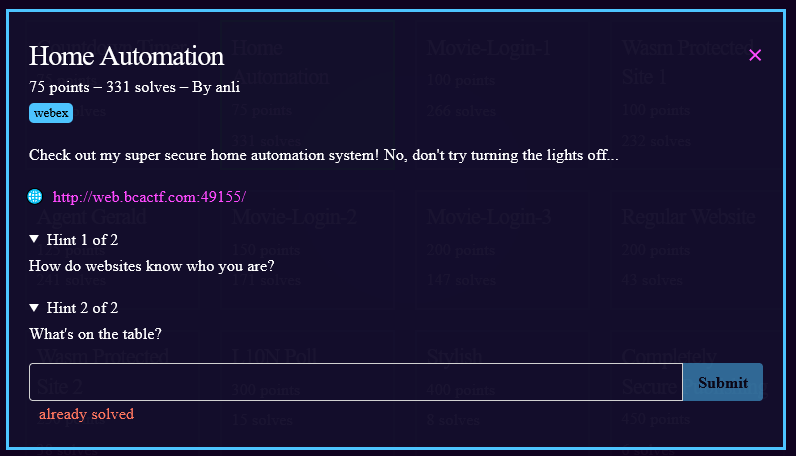
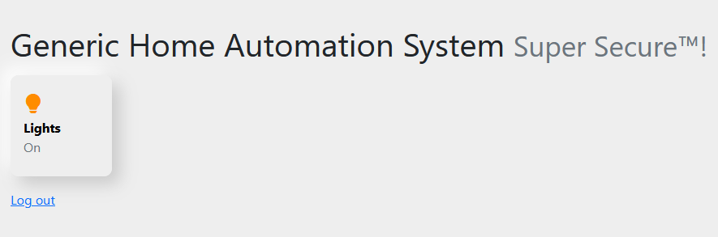
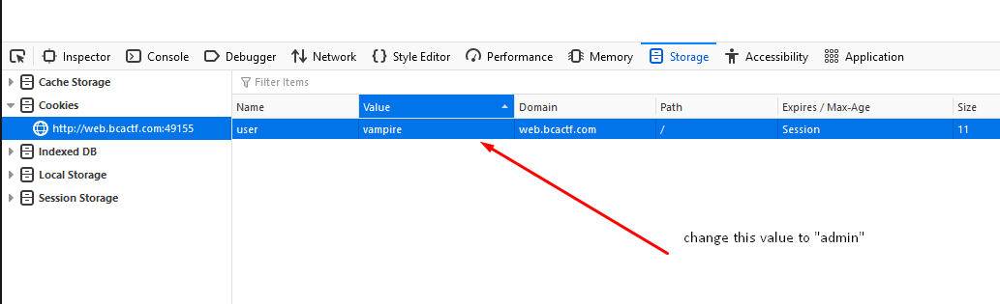

1) link takes us to a homepage with only option as "Log in as guest"; click it.
2) try to turn off the lights: 
3) turning the lights off gives us a message "You must be admin to turn off the lights. Currently you are "vampire".
4) Viewing our cookies we see that our value in our cookie is set to "vampire". change that value to admin

5) refresh page
6) We got the flag. flag: **bcactf{c00k13s\_s3rved\_fr3sh\_fr0m\_th3\_smart\_0ven\_cD7EE09kQ}**