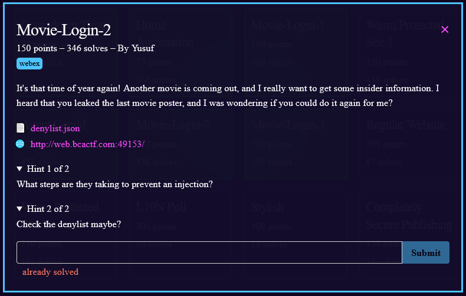
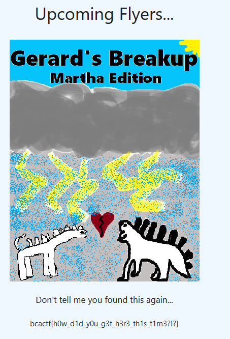

1) At the link we are greeted with another login page.
2)  the deny list shows that we can't use `[
    "1",
    "0",
    "/",
    "="
]`. So our technique of `' or '1' = '1` won't work this time. 
2) We can achieve the same affect with `' or '5' > '4`
3) enter the above for both the username and password.
4) We got the flag!

5) flag: **bcactf{h0w\_d1d\_y0u\_g3t\_h3r3\_th1s\_t1m3?!?}**