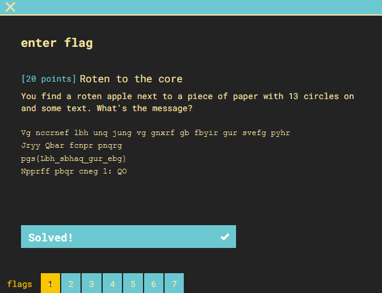
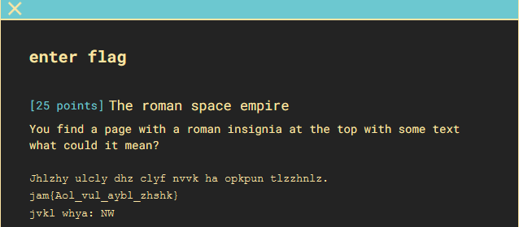
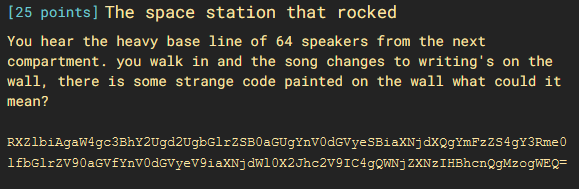
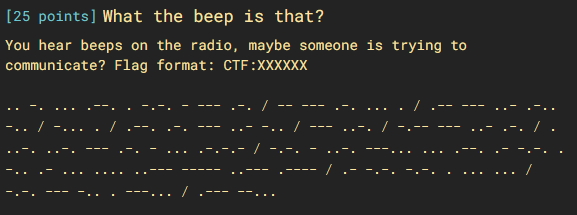
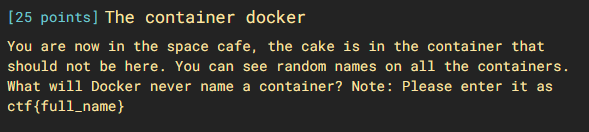
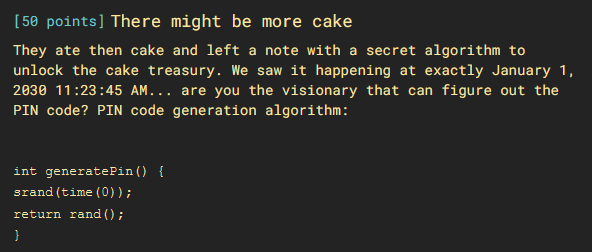
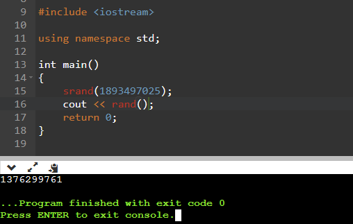
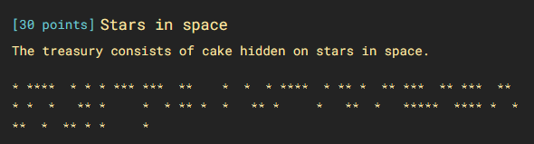

### Part 1



1) using [cyberchef](https://gchq.github.io/CyberChef/#recipe=ROT13(true,true,false,13)&input=VmcgbmNjcm5lZiBsYmggdW5xIGp1bmcgdmcgZ254cmYgZ2IgZmJ5aXIgZ3VyIHN2ZWZnIHB5aHIKSnJ5eSBRYmFyIGZjbnByIHBucXJnCnBnc3tMYmhfc2JoYXFfZ3VyX2ViZ30KTnBwcmZmIHBicXIgY25lZyAxOiBRTyA) with a ROT13 transformation produces the answer
2) <pre>
It appears you had what it takes to solve the first clue
Well Done space cadet
ctf{You_found_the_rot}
Access code part 1: DB 
</pre>
3) flag: **ctf{You_found_the_rot}**

### Part 2

1) another ROT question it seems.  using [cyberchef again](https://gchq.github.io/CyberChef/#recipe=ROT13(true,true,false,-7)&input=Smhsemh5IHVsY2x5IGRoeiBjbHlmIG52dmsgaGEgb3BrcHVuIHRsenpobmx6LgpqYW17QW9sX3Z1bF9heWJsX3poc2hrfQpqdmtsIHdoeWE6IE5X) we see it's a ROT -7
2) <pre>
Caesar never was very good at hiding messages.
ctf{The_one_true_salad}
code part: GP
</pre>
3) flag: **ctf{The_one_true_salad}**


### Part 3

1) "baseline of 64 speakers" must refer to base64. 
2) [Cyberchef to the rescue again](https://gchq.github.io/CyberChef/#recipe=From_Base64('A-Za-z0-9%2B/%3D',true)&input=IFJYWmxiaUFnYVc0Z2MzQmhZMlVnZDJVZ2JHbHJaU0IwYUdVZ1luVjBkR1Z5ZVNCaWFYTmpkWFFnWW1GelpTNGdZM1JtZTBsZmJHbHJaVjkwYUdWZlluVjBkR1Z5ZVY5aWFYTmpkV2wwWDJKaGMyVjlJQzRnUVdOalpYTnpJSEJoY25RZ016b2dXRVE9) using the from base64 decoder
3) <pre>
Even  in space we like the buttery biscut base. ctf{I_like_the_buttery_biscuit_base} . Access part 3: XD
</pre>
4) flag: **ctf{I_like_the_buttery_biscuit_base}**

### Part 4


1) Must be morse code
2) [Cyberchef continues to be my favorite tool](https://gchq.github.io/CyberChef/#recipe=From_Morse_Code('Space','Line%20feed')&input=Li4gLS4gLi4uIC4tLS4gLiAtLi0uIC0gLS0tIC4tLiAvIC0tIC0tLSAuLS4gLi4uIC4gLyAuLS0gLS0tIC4uLSAuLS4uIC0uLiAvIC0uLi4gLiAvIC4tLS4gLi0uIC0tLSAuLi0gLS4uIC8gLS0tIC4uLS4gLyAtLi0tIC0tLSAuLi0gLi0uIC8gLiAuLi0uIC4uLS4gLS0tIC4tLiAtIC4uLiAuLS4tLi0gLyAtLi0uIC0gLi4tLiAtLS0uLi4gLi4uIC4tLS4gLi0gLS4tLiAuIC0uLiAuLSAuLi4gLi4uLiAuLi0tLSAtLS0tLSAuLi0tLSAuLS0tLSAvIC4tIC0uLS4gLS4tLiAuIC4uLiAuLi4gLyAtLi0uIC0tLSAtLi4gLiAtLS0uLi4gLyAuLS0tIC0tLi4u) with its morse code decoder
3) <pre>INSPECTORMORSEWOULDBEPROUDOFYOUREFFORTS.CTF:SPACEDASH2021ACCESSCODE:J7
</pre>
4) flag: **ctf:SPACEDASH2021**

### Part 5

1) i haven't ever used docker but after some quick googling i found [this article](https://frightanic.com/computers/docker-default-container-names/) on naming containers
2) flag: **ctf{boring_wozniak}**

### Part 6

1) [researching srand](https://www.cplusplus.com/reference/cstdlib/srand/) shows that it's a pseudo-random generator based on seed. In this case the seed is defined as time(0). [A function that outputs the seconds since Jan 1 1970.](https://www.programiz.com/cpp-programming/library-function/ctime/time)
2) since we know the exact time this was executed we can get the seed value for srand using a [time converter](https://www.epochconverter.com/). It gives us the time epoch timestamp of 1893497025 (seconds since jan 1 1970).
3) i don't use c++, so i just used a [quick online compiler to test it out](https://www.onlinegdb.com/online_c++_compiler). 
4) Thankfully we didn't have to mess with any timezones on this:

5) flag: **1376299761**

### Part 7

1) A series of \*'s and spaces made me think of a binary pattern
2) i converted it to 1's and 0's with a short python script:
```
strng = "* ****  * * * *** ***  **    *  *  * ****  * ** *  ** ***  ** ***  ** * *  *   ** *     *  * ** *  *   ** *     *   **  *   *****  **** *  ***  *  ** * *     * "
output = ""

for i in strng:
    if i == "*":
        output += "1"
    elif i == " ":
        output += "0"
		
print(output)
```
3) output: <pre>1011110010101011101110011000010010010111100101101001101110011011100110101001000110100000100101101001000110100000100011001000111110011110100111001001101010000010
</pre>
4) i put this into [cyberchef](https://gchq.github.io/CyberChef/#recipe=Magic(3,true,true,'ctf%7B')&input=MTAxMTExMDAxMDEwMTAxMTEwMTExMDAxMTAwMDAxMDAxMDAxMDExMTEwMDEwMTEwMTAwMTEwMTExMDAxMTAxMTEwMDExMDEwMTAwMTAwMDExMDEwMDAwMDEwMDEwMTEwMTAwMTAwMDExMDEwMDAwMDEwMDAxMTAwMTAwMDExMTExMDAxMTExMDEwMDExMTAwMTAwMTEwMTAxMDAwMDAxMA) using a crib of "ctf" and got the flag
5) flag: **ctf{hidden_in_space}**