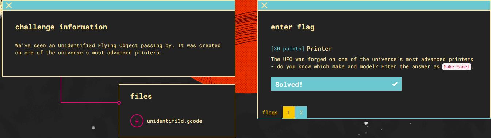
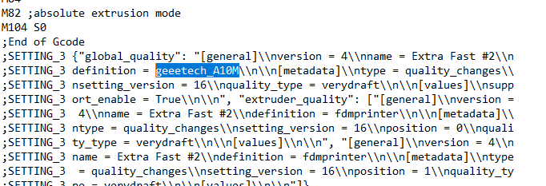
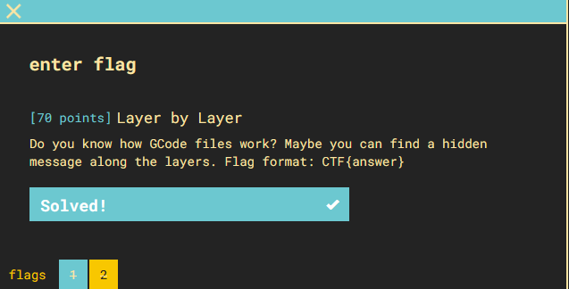

### Part 1

Files: [unidentifi3d.gcode](unidentifi3d.gcode)
1) Opening the .gcode file in notepad shows some stuff about extruding
2) Googling the ".gcode" extension shows its information from a 3D printer
3) At the bottom of the file is the make/model information
4) 
5) flag: **geeetech A10M**

### Part 2

1. I used a [GCODE Analyzer](https://gcode.ws/) for this one
2. after playing around with the 2D layers for awhile i found it
3. 
4. flag: **CTF{flying_saucer}**