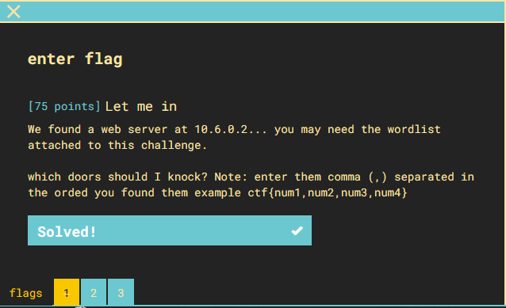

## Part 1

files: [wordlist](ChallengeWordlist.txt)

1) The fact that this challenge is instanced and we are given a wordlist means that we will have to do some tool based enumeration
2) I used [gobuster](https://github.com/OJ/gobuster) for this:
`gobuster dir -u 10.6.0.2/WhoIsThere -w ChallengeWordlist.txt`
3) output gives only one directory called "/WhoIsThere"
4) 10.6.0.2/WhoIsThere/ gives another directory with one entry "OpenSesame"
5) 10.6.0.2/WhoIsThere/OpenSesame gives a page that reads:
<pre>
It would be a tcp syn to knock on the doors of air locks:
1337
68
61
78
</pre>
6) flag: **ctf{1336,68,61,78}**

## Part 2