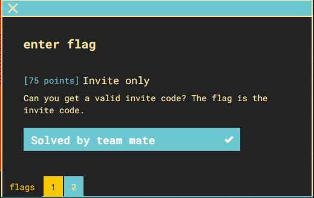
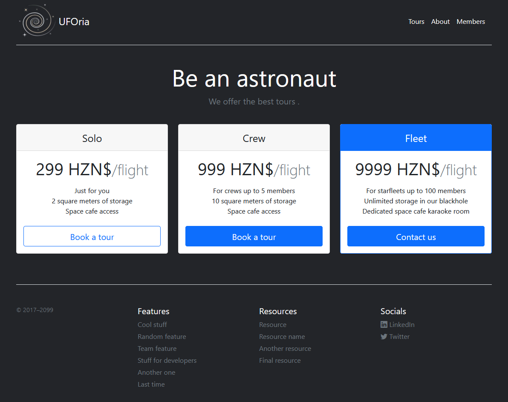
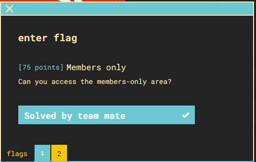
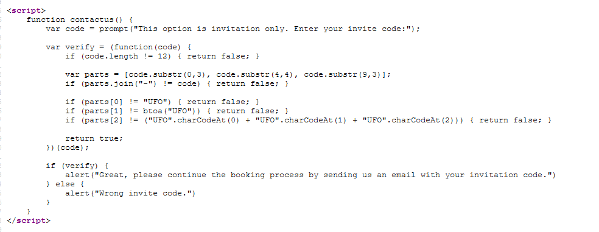

## Part 1

1) The challenge is instanced but clicking the link takes you to a page that allows you to book flights.

2) the only links that work are "Contact us", "about", "Linkedin", and "members" links
3) on the about page, the CEO signs off with a nickname "borgana"
5) Trying this as a username and using "recover password" we are prompted with a security question of "what is your place of birth?"
6) Back to the about page the CoFounder Elliot Talton is mentioned. It's mentioned that they share a hometown with our CEO. Elliot has a [linkedin profile](https://www.linkedin.com/in/elliot-talton/detail/recent-activity/) we can research.
7) Elliot Talton has a post talking about visiting a restaurant called ["Lands Huys Cafe"](https://www.google.com/search?client=firefox-b-1-d&q=Lands+Huys+Caf%C3%A9). which is in Bourtange, Netherlands.  Now we have our Hometown!
8) using "Bourtange" as the place of birth gives us the password "fataborgana42"
9) logging in gives us the flag: **CTF{fataborgana42}**

## Part 2

1) Now what? the only other thing that works is the Fleet flight, which asks for an invite code
2) guess I will inspect the source code and see if I find any goodies.  Here is the script running on the page:

3) looks like the script checks the invite code for the following:
- it's 12 characters long
- first 3 characters are UFO
- next 4 are the letters UFO taken as input for the [btoa (base64 function)](https://developer.mozilla.org/en-US/docs/Web/API/WindowOrWorkerGlobalScope/btoa)
- last 3 are the ASCII values of letters "U", "F", and "O" added together.
4) putting together all of the above gives code: UFO-VUZP-234. the website accepts it and it's also the flag
5) flag: **CTF{UFO-VUZP-234}**