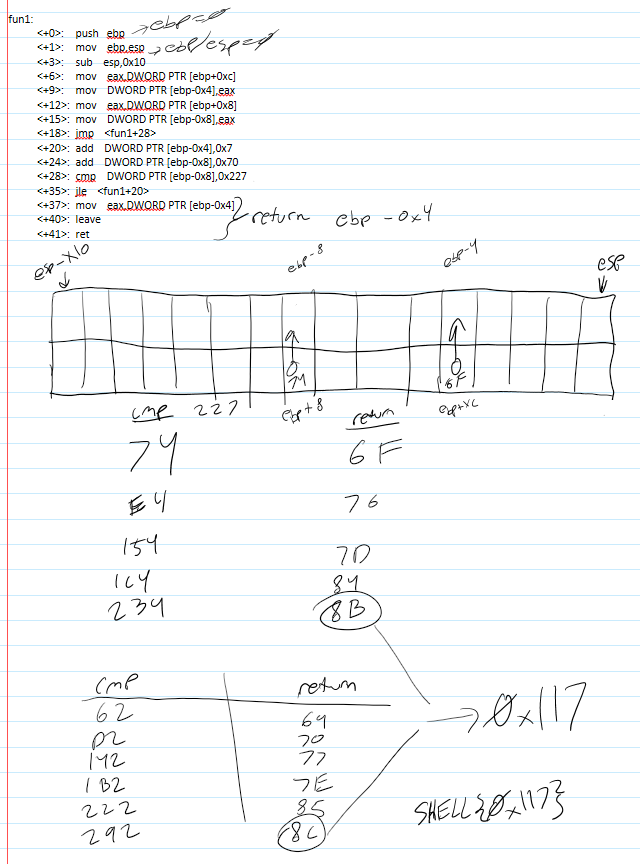

Question:

fun1(0x74,0x6f) + fun1(0x62,0x69) = ?
Note : submit flag in hexadecimal format (e.g. 0x123dead) and wrap it in SHELL{ & }.

files: [asm_code.txt](asm_code.txt)

1) opening the file gives some assembly code that essentially takes in 2 numbers and compares the first one to 0x227. if the first number is less than 0x227, then increase the second number by 0x7. repeat until the first number is greater or equal to 0x227. then return the second number
2) using input values of (0x74,0x6F) we get 0x8B
3) using input valuesof (0x62, 0x69) we get 0x8C
4) 0x8B +0x8C = 0x117
5) **Flag: SHELL{0x117}**

note: i am awful at assembly and actually had to draw this out. see below for my sloppy work.

