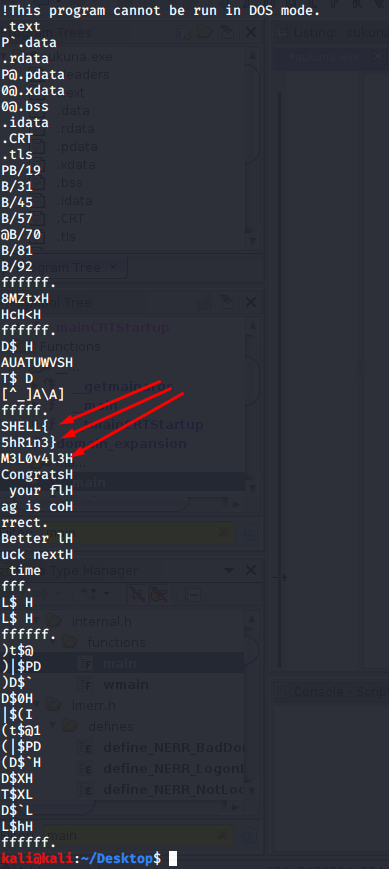
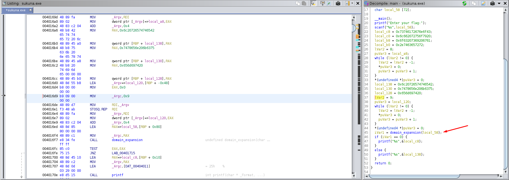
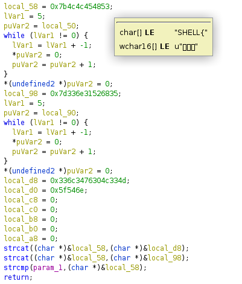
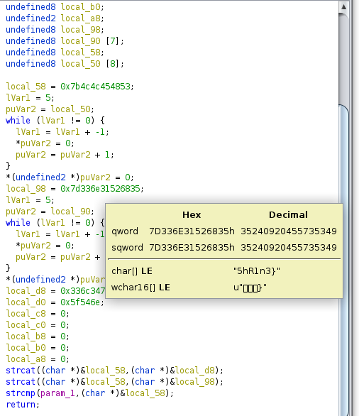
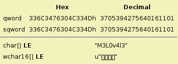

Question: Somebody told me this executable has priceless info hidden
files: sukuna.exe

- sakuna is an executable that asks for the flag and then immediately exits.  

1) see if we can find the flag stored in plaintext `strings sakuna.exe`

2) that looks like the flag.  lets try "SHELL{M3L0v4l3h5hR1n3}"
3) that doesn't work, maybe we are missing some more characters.  
4) open in ghidra

6) looks like the main function calls function 'domain expansion'
7) 'domain expansion' is checking the user input against some strings those strings are:

put them together and we have the flag!
**flag: SHELL{M3L0v4l3nT_5hR1n3}**
