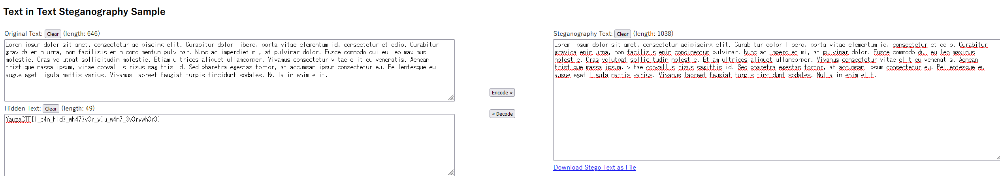

# LOREM-IPSUM

[lorem_ipsum.txt](lorem_ipsum.txt)

1) opening with notepad didn't show any obvious things

2) `xxd lorem_ipsum.txt` gives some interesting results (abridged for readability)

 - lots of characters in between the ASCII ones

 3) [apparently these characters are 'zero width characters'](https://medium.com/@umpox/be-careful-what-you-copy-invisibly-inserting-usernames-into-text-with-zero-width-characters-18b4e6f17b66)

4) was able to convert them using [this site](https://330k.github.io/misc_tools/unicode_steganography.html)

