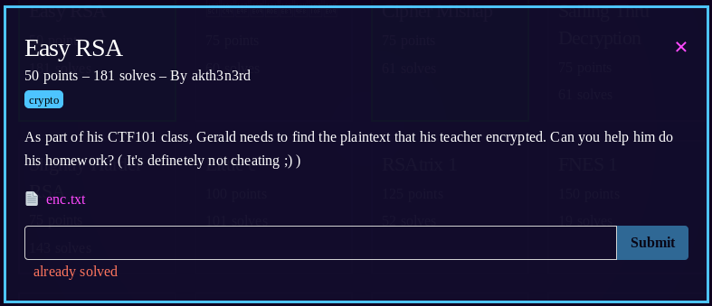

1) enc.txt contains p, q, n, e, and ciphertext values
2) using [RSACTFtool](https://github.com/Ganapati/RsaCtfTool)
3) ```RsaCtfTool/RsaCtfTool.py --uncipher 5247423021825776603604142516096226410262448370078349840555269847582407192135 -p 251867251891350186672194341006245222227 -q 31930326592276723738691137862727489059 -n 8042203610790038807880567941309789150434698028856480378667442108515166114393 -e 65537```
4) output:
<pre>
Unciphered data :
HEX : 0x0000006263616374667b5253415f49535f454153595f41465445525f414c4c7d
INT (big endian) : 2652540753558987928135559621775165718420934450124971589287668131581053
INT (little endian) : 56673912744988857163015555874781284710133857494425659786881582989612362498048
STR : b'\x00\x00\x00bcactf{RSA_IS_EASY_AFTER_ALL}'
</pre>
5) **flag: bcactf{RSA_IS_EASY_AFTER_ALL}**