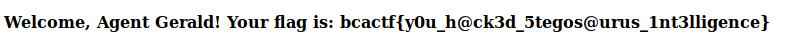

1) Visiting the page gives us:

2) The text mentions using a special browser.  Websites know what browser or [user agent](https://developer.mozilla.org/en-US/docs/Web/HTTP/Headers/User-Agent) you are using based on your get request to the page.
3) we can change that user agent value using [burpsuite](https://portswigger.net/burp)

4) And we get the flag! 
5) flag: **bcactf{y0u_h@ck3d_5tegos@urus_1nt3lligence}**