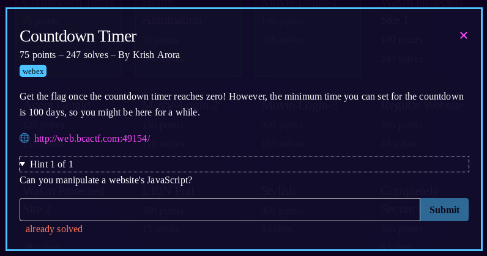
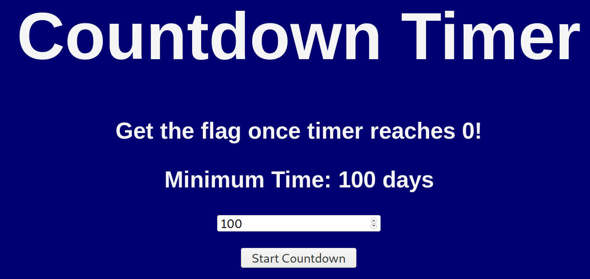
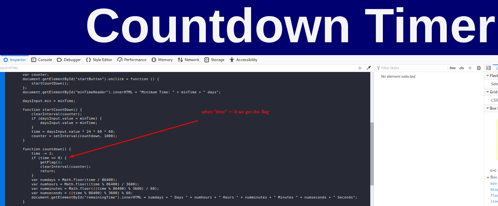
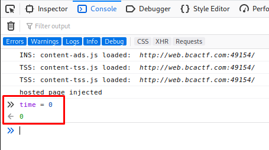

1) Go to the link listed

2) When you click "start countdown" a timer starts counting down from 100 days, refresh page, you can't decrease the start value lower than 100 either
3) looking at the source we see the javascript running and notice that when the "time" variable reaches zero we get the flag. 
4) Start the timer
5) in "console" manually set the "time" variable to "0"

6) We got the flag 
7) flag: **bcactf{1_tH1nK_tH3_CtF_w0u1D_b3_0v3r_bY_1O0_dAy5}**