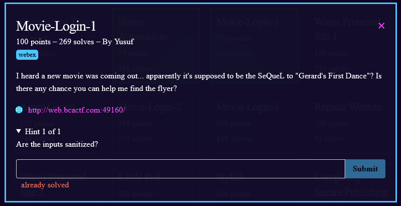
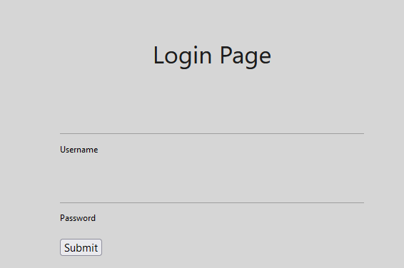

1) go to the link
2) 
3) default credentials don't work and there isn't anything suspicious about the source. so i tried a [basic inject](https://www.w3schools.com/sql/sql_injection.asp) to see if i can get the login page to return TRUE for me 
4) user: `' or '1' == '1` password: `' or '1' == '1`
5) This gave us the flag!
6) flag: **bcactf{s0\_y0u\_f04nd\_th3\_fl13r?}**