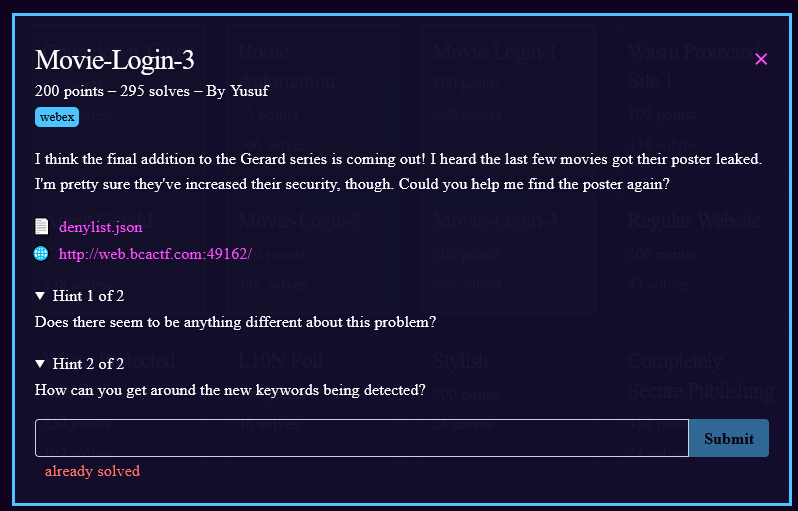

1) Another login page is at the link
2) looking at the deny list `[
    "and",
    "1",
    "0",
    "true",
    "false",
    "/",
    "*",
    "=",
    "xor",
    "null",
    "is",
    "<",
    ">"
]` it's a little more in depth than last time.
3) We can still bypass is with `' or '5' - '4`.
4) Enter the above for the username/password
5) We got the flag!

6) flag: **bcactf{gu3ss\_th3r3s\_n0\_st0pp1ng\_y0u!}**