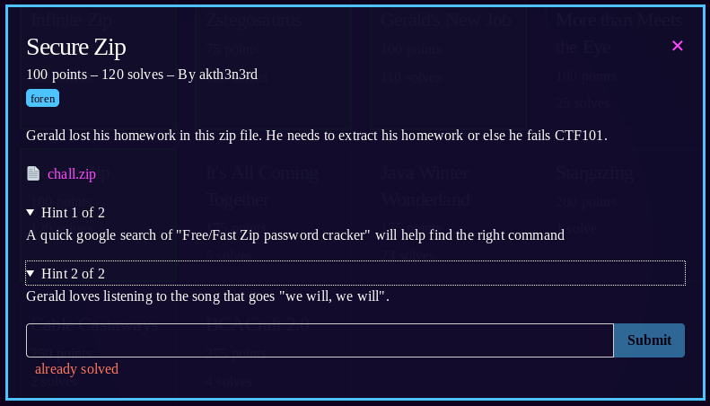

1) `unzip chall.zip` shows that it's password protected
1) lets try and crack it with john
1) 
```
zip2john chall.zip > zippy
john zippy --wordlist=/usr/share/wordlists/rockyou.txt
```

4) output gives password as "dogedoge".
5) gives two items "homework.txt" "flag.txt".
6) `cat flag.txt`
<pre>
bcactf{cr4ck1ng_z1p_p455w0rd5_15_fun_a12ca37bdacef7}
</pre>
7) **flag: bcactf{cr4ck1ng_z1p_p455w0rd5_15_fun_a12ca37bdacef7}**
