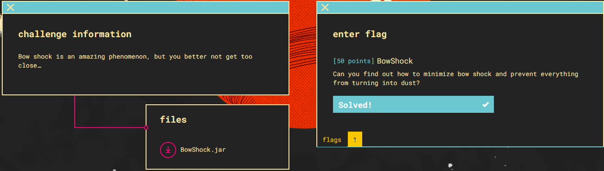
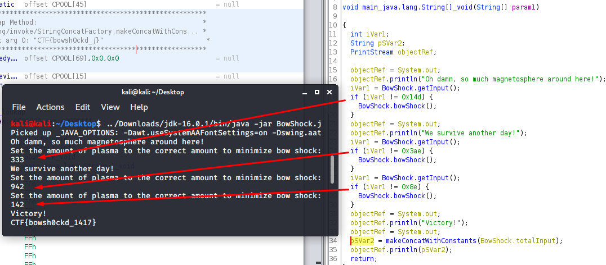

files: [bowshock.jar](BowShock.jar)

1) Running the .jar file gives:
<pre>
Oh damn, so much magnetosphere around here!
Set the amount of plasma to the correct amount to minimize bow shock: 
</pre>
- it's prompting for input and if you give the wrong number the program exits with a message

2) open with Ghidra and looking at the decompiler gives us what the solutions are for the prompt

 - The values are in hex. Convert to dec and enter them: 333, 942, 142
 
 3) flag: **CTF{bowsh0ckd_1417}**

- Alternatively, you can see that the string "CTF{bowsh0ckd_}" is already in the class and the flag is created by concatening the total input as a string to it.  (333+942+142 = 1417)