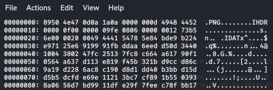

Question: 
<pre>
Brad wanted to send a msg to Raj but he wanted to hide it from his wife? Can you help Raj decode it?
Note : Wrap the flag in 'SHELL{' & '}'.
</pre>
files: HIDDEN_INSIDE_2.jpg

1) similiar to the last one, i noticed that even though it has a .jpg extension, it has a .PNG magic number 
`xxd HIDDEN_INSIDE_2.jpg | more`

2) changing it to a png `mv HIDDEN_INSIDE_2.jpg hidden2.png`
3) did some more [research on steganography in PNGs](https://shanereilly.net/posts/basic_steganography_and_png_files/) and remembered zsteg
4) `zsteg hidden2.png` 
<pre>
imagedata           .. file: Apple DiskCopy 4.2 image \006, 16711680 bytes, 0x10100 tag size, GCR CLV ssdd (400k), 0xff format
b1,r,lsb,xy         .. text: "NarUTO_Is_hokaGE"
b1,g,lsb,xy         .. file: PNG image data, 534 x 66, 8-bit/color RGBA, non-interlaced
b1,bgr,lsb,xy       .. text: "G13Hd'I\t"
b1,abgr,msb,xy      .. file: PGP Secret Sub-key -
b2,r,msb,xy         .. text: "z@(Z}v-J"
b3,bgr,msb,xy       .. text: "F3BNF8qb"
b3,rgba,lsb,xy      .. text: "w7Swws{?"
b3,abgr,msb,xy      .. text: "gz&G|DGt&gr"
b4,r,lsb,xy         .. text: "c$UR%R$C#5D2%E#%C#\#$C$UU#EUU%DR'C3B5'CS"
b4,r,msb,xy         .. text: "\"Ll*\"bNd**"
b4,g,lsb,xy         .. text: "tDTEEE$dEDUTEDEUB$S%DDTT$ETVDFtVd$DD&BB"
b4,g,msb,xy         .. text: "*j\"b.j&$\"\"dBB \"\"\"\"\"D"
b4,rgb,lsb,xy       .. text: "X$eWTrV\"TGF"
b4,bgr,lsb,xy       .. text: "XRd'UtVRR'D"
b4,rgba,lsb,xy      .. text: "4o$o5o4oT"
</pre>
5) couple of interesting things here
	1) the "naruto is hokage" message from hidden1
	2) a hidden png file sized 534x66
	3) PGP Secret sub-key?
6) Extract the hidden image `zsteg -E b1,g,lsb,xy hidden2.png > new.png`
7) open it up

**flag: SHELL{RayMONd_redDINTON_isNOt_iLLYA}**
