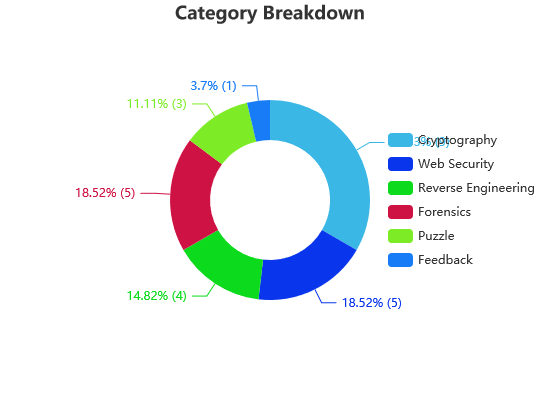
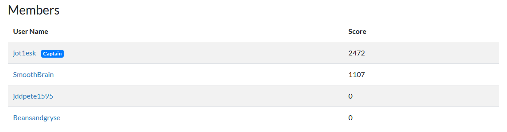

# S.H.E.L.L. CTF

## Categories:

1. Puzzle
2. Forensics
3. Cryptography
4. Reverse Engineering
5. Web Security

## Performance

SHELL was advertised as a beginner CTF and I think it stayed true to that.  It was the first CTF where I actually dedicated a full weekend to in order to capture as much flags as possible.  This was my first CTF competing with a team.  Of that team only two of us got any solves. between the two of us we managed 3544 points and **[placed 23rd of 533 teams](https://ctftime.org/team/155547)**. We managed to complete the entire forensics, web security, and reverse engineering category. The only ones we couldn't solve were 3 cryptography questions and one puzzle question (Cyber Attack 3).The questions i've solved are in this repo, the questions he solved can be found at [Smoothbrain's repo here](https://github.com/RandomPost/CTF-Writeups). 

## Feedback
Most of the challenges were pretty good. It was very cryptography heavy though and I would have appreciated more in the reverse engineering category as i feel that is my weakest domain.  The puzzle category was a bit of a mess and i think nearly every team struggled with it. I think it was intended to be an OSINT category, but it devolved into bruteforcing the flag on multiple questions.  As for the infrastructure, i didn't like the concept of "buying hints" with points, because a lot of teams just made a new account and bought the hint with a fake account so as not to affect their team's score.  Also, i know it's commonplace, but decrementing the points per solve based on the amount of solves kinda through me off too (hence why our end score is lower than the picture above).

## Writeups

1. [Algoric-Shift](Algoric-Shift/README.md)
2. [arc-cipher](arc-cipher/README.md)
3. [Assembly](Assembly/README.md)
4. [BruteForceRSA](BruteForceRSA/README.md)
5. [check_flag](check_flag/README.md)
6. [CJK](CJK/README.md)
7. [Cold_Compress](Cold_Compress/README.md)
8. [Grass is green](Grass is green/README.md)
9. [Hidden Inside](Hidden Inside/README.md)
10. [Hidden Inside2](Hidden Inside 2/README.md)
11. [keygen](keygen/README.md)
12. [poly alpha](poly alpha/README.md)
13. [Sakuna](Sakuna/README.md)
14. [Subsi](Subsi/README.md)
15. [anonym](anonym.md)
16. [collide](collide.md)
17. [Cyber Attack 1](Cyber Attack 1.md)
18. [Cyber Attack 2](Cyber Attack 2.md)
19. [Cyber Attack 4](Cyber Attack 4.md)
20. [Easy RSA](Easy RSA.md)
21. [encoder](encoder.md)
22. [Haxxor](Haxxor.md)
23. [login](login.md)
24. [Under Development](Under Development.md)