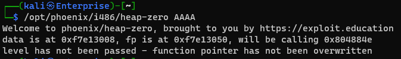
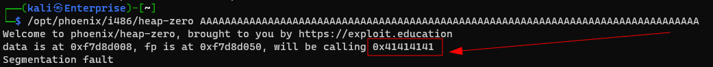
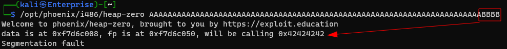
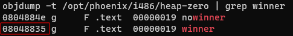
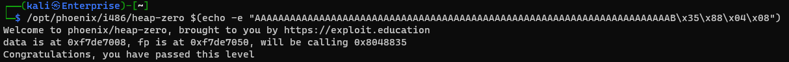

# Heap Zero

```c
/*
 * phoenix/heap-zero, by https://exploit.education
 *
 * Can you hijack flow control, and execute the winner function?
 *
 * Why do C programmers make good Buddhists?
 * Because they're not object orientated.
 */

#include <err.h>
#include <stdio.h>
#include <stdlib.h>
#include <string.h>
#include <unistd.h>

#define BANNER \
  "Welcome to " LEVELNAME ", brought to you by https://exploit.education"

struct data {
  char name[64];
};

struct fp {
  void (*fp)();
  char __pad[64 - sizeof(unsigned long)];
};

void winner() {
  printf("Congratulations, you have passed this level\n");
}

void nowinner() {
  printf(
      "level has not been passed - function pointer has not been "
      "overwritten\n");
}

int main(int argc, char **argv) {
  struct data *d;
  struct fp *f;

  printf("%s\n", BANNER);

  if (argc < 2) {
    printf("Please specify an argument to copy :-)\n");
    exit(1);
  }

  d = malloc(sizeof(struct data));
  f = malloc(sizeof(struct fp));
  f->fp = nowinner;

  strcpy(d->name, argv[1]);

  printf("data is at %p, fp is at %p, will be calling %p\n", d, f, f->fp);
  fflush(stdout);

  f->fp();

  return 0;
}
```

## Solution

Very similiarly to the basic stack overflow exercises we must overflow `d` and overwrite `f->fp`

1. What happens with normal input: 
2. Increase the "A" until it changes: 
3. Find Where exactly it changes: 
4. Now that we know where we are writing to, figure out what to write with `objdump -t /opt/phoenix/i486/heap-zero | grep "winner"` 
5. Add it as the address in little endian and solve the challenge: 