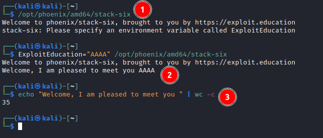
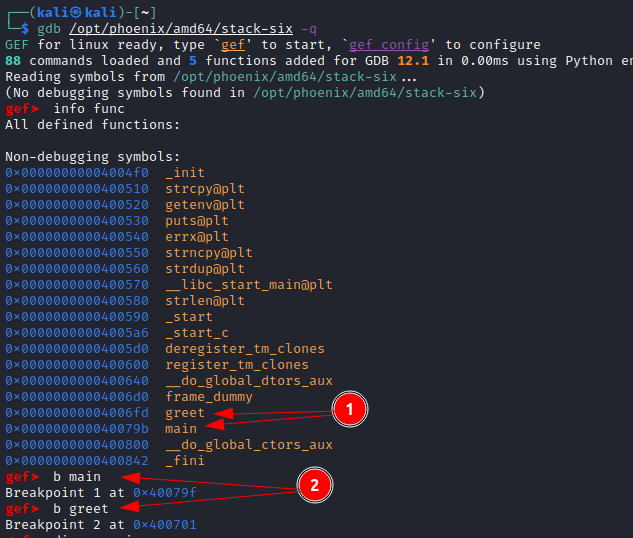
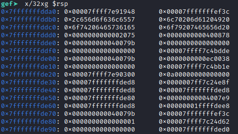
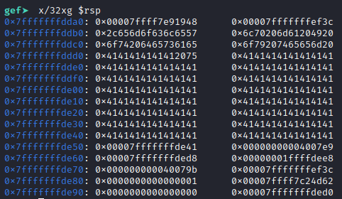
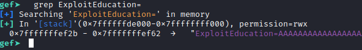
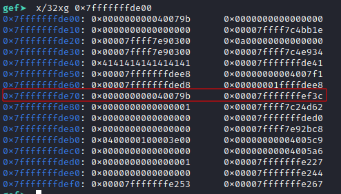
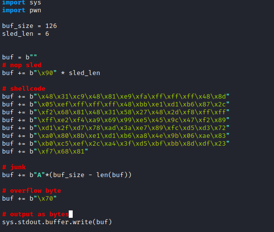
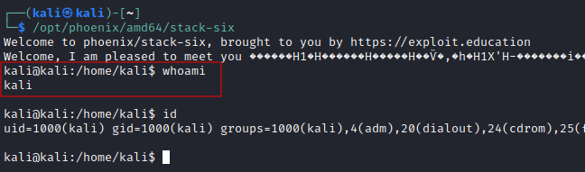

# Stack Six

```c
/*
 * phoenix/stack-six, by https://exploit.education
 *
 * Can you execve("/bin/sh", ...) ?
 *
 * Why do fungi have to pay double bus fares? Because they take up too
 * mushroom.
 */

#include <err.h>
#include <stdio.h>
#include <stdlib.h>
#include <string.h>
#include <unistd.h>

#define BANNER \
  "Welcome to " LEVELNAME ", brought to you by https://exploit.education"

char *what = GREET;

char *greet(char *who) {
  char buffer[128];
  int maxSize;

  maxSize = strlen(who);
  if (maxSize > (sizeof(buffer) - /* ensure null termination */ 1)) {
    maxSize = sizeof(buffer) - 1;
  }

  strcpy(buffer, what);
  strncpy(buffer + strlen(buffer), who, maxSize);

  return strdup(buffer);
}

int main(int argc, char **argv) {
  char *ptr;
  printf("%s\n", BANNER);

#ifdef NEWARCH
  if (argv[1]) {
    what = argv[1];
  }
#endif

  ptr = getenv("ExploitEducation");
  if (NULL == ptr) {
    // This style of comparison prevents issues where you may accidentally
    // type if(ptr = NULL) {}..

    errx(1, "Please specify an environment variable called ExploitEducation");
  }

  printf("%s\n", greet(ptr));
  return 0;
}
```

## Observations

First we run it just to see some behavior:


1. It requires an env variable called `ExploitEducation`
2. It uses the env variable value to append to a message `Welcome, I am pleased to meet you `.
3. This message is 35 characters long
4. The buffer provided isn't initialized, so some garbage values can show up in the response.

## Solution


The code checks if the env variable provided is greater than the buffer size, but it doesn't account for the 35 characters from the welcome message that are already in the buffer. This means we could potentially overflow by 35 characters and that we can potentially corrupt something 128 + 35 - 1 = 162 characters from the start of the buffer and we can send up to 127 bytes.

Note: as per previous exercises you will need to ensure ASLR is turned off for this to work.

1. Let's send it some `A`s and see what happens 
2. We are definitely breaking something. Let's take a closer look in gdb.
   1. I'm using `gdb-gef` here. You can [check it out here](https://github.com/hugsy/gef)
   2. `export ExploitEducation=$(python3 -c 'print("A"*127)')`
   3. `gdb -q /opt/phoenix/amd64/stack-six`
3. 
   1. These are the functions we saw in the source code
   2. set some breakpoints with `b` and the function name
4. Set a breakpoint on the vulnerable location
   1. `b *greet+128`
5. `run` and `continue` to the vulnerability
6. The stack before the `A`'s arrive. 
7. The stack after the `A`'s arrive. 
8. Looks like we overflowed the value at `0x7fffffffde50` by one byte. As we can see in our registers it's the location where the [base pointer](https://stackoverflow.com/questions/41912684/what-is-the-purpose-of-the-rbp-register-in-x86-64-assembler) is stored. The base pointer is used by the program to remember where to return to when a function exits. The `0x7fffffffde50` address is the `$rbp` for this function, but it's value `0x7fffffffde41` is the `$rbp` for the calling function `main()`. Since we have control of the last byte, we can make it so that when `main()` returns the program will go to a place in memory that we control. The only place in `main()` that we control memory is from the `env` variable we provided `ExploitEducation`.
9. environmental variables sit on the stack, and we can find them by searching for it with the command `grep ExploitEducation=` 
   1.  The string starts at `0x7fffffffef2b`, the data doesn't actually begin until that value + 17 bytes because `len("ExploitEducation=")` is 17. This means the space we control is from address `0x7fffffffef3c` to `0x7fffffffefba`. If we can get the `$rbp` to point to somewhere in that range we can get a shell.
10. The range we have to manipulate is only the last byte of the pointer `0x7fffffffde__`. Lets go to the end of the program and see what is there at that moment. `b *main+92` to break on the final instruction.
11. `x/32xg 0x7fffffffde00`. Sure enough, there is our target address `0x7fffffffef3c`! 
12. all we have to do now is set the `$rbp` to be `0x7fffffffde70` and put some shellcode in our buffer.
    1.  The reason we want `0x7fffffffde70` and not `0x7fffffffde78` (the location of `0x7fffffffef3c`), is because the `leave` instruction (second to last instruction in `main()`) will `mov esp, ebp` and `pop ebp`. In other words it:
        1.  Sets the stack pointer `RSP` to the value of hte base pointer `RBP`
        2.  pops the saved base pointer from the stack into the pointer register `RBP`
    2.  Then `ret` (the last instruction in `main()`) will:
        1.  pop the next value to `RIP`. so if our next value (`$RBP + 8`) is the location of the shell code, it will execute our payload.
13. Make the payload:
    1.  shellcode: `msfvenom -p linux/x64/exec -f python CMD=/bin/bash -b '\x00\x0a\x0d\x20'` creates an 87 byte payload (smaller ones are available on the web too)
    2.  nop sled length is arbitrary, but i'm using 6 because i like the allignment it gives. All that really matters is that the shellcode is there and that the overflow byte is `0x70`
    3.  
14. `export ExploitEducation=$(python3 solve.py)`
15. `/opt/phoenix/amd64/stack-six`
16. 

## Troubleshooting
1. If your exploit works in gdb, but not in the terminal it's likely that your environment variables aren't the same between the two. Sometimes it's as simple as `unset env LINES` and `unset env COLUMNS` in gdb. However, if it's still occuring you can try to export them to files and compare the two.
   1. in terminal: `env > cli_env.txt`
   2. in gdb: `show env` and copy paste into `gdb_env.txt`.
   3. `diff cli_env.txt gdb_env.txt`
   4. This will compare the two.
2. Closing and reopening the terminal window can help sometimes too.
3. Since gdb takes on the environment variables from the window it's launched, run your exploit and gdb from the same window, just exit gdb first.
4. ensure ASLR is off.